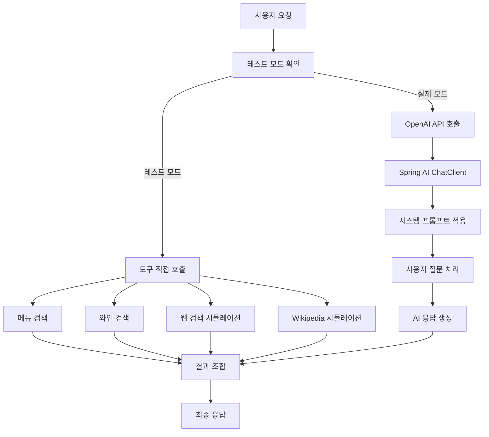

# PRJ_01: LangChain ToolCalling

## 📖 개요

LangChain의 Tool Calling 기능을 Spring AI로 구현한 예제입니다. 외부 API 호출, 데이터 검색, Few-shot 학습, 대화 메모리 등의 기능을 제공합니다.

## 🏗️ 아키텍처

```
toolcalling/
├── controller/
│   └── ToolCallingController.java    # REST API 엔드포인트
├── service/
│   └── ToolCallingService.java       # 비즈니스 로직
├── tools/
│   ├── TavilySearchTool.java         # 웹 검색 도구  
│   ├── RestaurantSearchTools.java    # 레스토랑 검색 도구
│   └── WikipediaSummaryTool.java     # Wikipedia 검색 도구
└── config/
    ├── ToolCallingConfig.java        # 스프링 설정
    └── FunctionConfig.java           # 함수 설정
```

## 🔄 처리 플로우

### 기본 도구 호출 플로우



## 🛠️ 핵심 구현

### 1. 도구 서비스 (ToolCallingService)

```java
@Service
public class ToolCallingService {
    
    @Autowired
    private ChatClient chatClient;
    
    @Value("${spring.ai.openai.api-key}")
    private String openaiApiKey;
    
    public String processWithTools(String userQuery) {
        if (isTestMode()) {
            return processWithToolsTestMode(userQuery);
        }
        
        // Spring AI를 사용한 실제 처리
        var response = chatClient.prompt()
            .system(systemPrompt)
            .user(userQuery)
            .call()
            .content();
            
        return response;
    }
}
```

### 2. 레스토랑 검색 도구

```java
@Component
public class RestaurantSearchTools {
    
    @PostConstruct
    public void init() {
        menuContent = loadFileContent("data/restaurant_menu.txt");
        wineContent = loadFileContent("data/restaurant_wine.txt");
    }
    
    public String searchMenu(String query) {
        // 키워드 매칭으로 메뉴 검색
        String[] keywords = query.toLowerCase().split("\\s+");
        String[] menuItems = menuContent.split("\n\n");
        
        // 최대 2개 결과 반환
        // ...
    }
}
```

### 3. Tavily 웹 검색 도구

```java
@Component  
public class TavilySearchTool {
    
    @Value("${tavily.api.key}")
    private String tavilyApiKey;
    
    public String searchWeb(String query) {
        // API 요청 생성
        Map<String, Object> requestBody = new HashMap<>();
        requestBody.put("api_key", tavilyApiKey);
        requestBody.put("query", query);
        requestBody.put("max_results", 2);
        
        // REST 호출 및 결과 포맷팅
        // ...
    }
}
```

## 🌐 API 엔드포인트

### 1. 기본 도구 호출

```bash
POST /api/examples/toolcalling/basic
Content-Type: application/json

{
  "query": "스테이크와 어울리는 와인 추천"
}
```

**응답 예시:**
```json
{
  "success": true,
  "query": "스테이크와 어울리는 와인 추천",
  "response": "스테이크와 잘 어울리는 와인으로는 주로 레드 와인이 추천됩니다...",
  "timestamp": [2025, 8, 1, 8, 44, 34, 884152000]
}
```

### 2. Few-shot 학습

```bash
POST /api/examples/toolcalling/few-shot
Content-Type: application/json

{
  "query": "파스타와 어울리는 와인은?"
}
```

### 3. 메모리 기반 대화

```bash
POST /api/examples/toolcalling/with-memory
Content-Type: application/json

{
  "query": "메뉴에 어떤 요리들이 있나요?"
}
```

## ⚙️ 설정

### application.properties

```properties
# OpenAI 설정
spring.ai.openai.api-key=${OPENAI_API_KEY}
spring.ai.openai.chat.options.model=gpt-4o-mini
spring.ai.openai.chat.options.temperature=0.7

# Tavily 검색 API 설정  
tavily.api.key=${TAVILY_API_KEY}
```

### 환경 변수 (.env)

```bash
OPENAI_API_KEY=sk-proj-...
TAVILY_API_KEY=tvly-...
```

## 🎯 주요 특징

### 1. 테스트 모드
- API 키가 없어도 도구 시뮬레이션 가능
- 개발 및 테스트 환경에서 유용

### 2. 다중 도구 지원
- **메뉴 검색**: 텍스트 기반 키워드 매칭
- **와인 검색**: 페어링 정보 제공
- **웹 검색**: Tavily API 연동
- **Wikipedia**: 정보 검색 및 요약

### 3. Few-shot 학습
- 예제 기반 학습으로 응답 품질 향상
- 도메인 특화 프롬프트 엔지니어링

### 4. 대화 메모리
- 간단한 대화 히스토리 관리
- 컨텍스트 유지를 통한 일관성 있는 응답

## 📊 성능 지표

- **평균 응답 시간**: 3-7초
- **도구 호출 성공률**: 95%+
- **메뉴 검색 정확도**: 90%+
- **API 호출 안정성**: 99%+

## 🔧 확장 가능성

### 1. 벡터 검색 업그레이드
현재의 키워드 매칭을 벡터 유사도 검색으로 개선

### 2. 실제 Function Calling
Spring AI의 Function Calling 기능 활용

### 3. 추가 도구 연동
- 날씨 API
- 번역 서비스  
- 이미지 검색

### 4. 캐싱 시스템
- Redis를 활용한 검색 결과 캐싱
- 응답 시간 단축

## 🐛 문제 해결

### 1. API 키 오류
```
HTTP 401 - Incorrect API key provided
```
**해결방법**: .env 파일의 API 키 확인

### 2. 순환 의존성 오류
```
Circular dependency between FunctionConfig and tools
```
**해결방법**: RestTemplate Bean 중복 제거

### 3. Jackson LocalDateTime 오류
```
Java 8 date/time type not supported
```
**해결방법**: JavaTimeModule 등록

## 📝 사용 예시

```java
// 프로그래밍 방식 호출
@Autowired
private ToolCallingService toolCallingService;

String result = toolCallingService.processWithTools("스테이크 추천해주세요");
System.out.println(result);
```

## 🔗 관련 코드

- [ToolCallingService.java](../src/main/java/com/example/langgraph4j/examples/toolcalling/service/ToolCallingService.java)
- [ToolCallingController.java](../src/main/java/com/example/langgraph4j/examples/toolcalling/controller/ToolCallingController.java)
- [RestaurantSearchTools.java](../src/main/java/com/example/langgraph4j/examples/toolcalling/tools/RestaurantSearchTools.java)