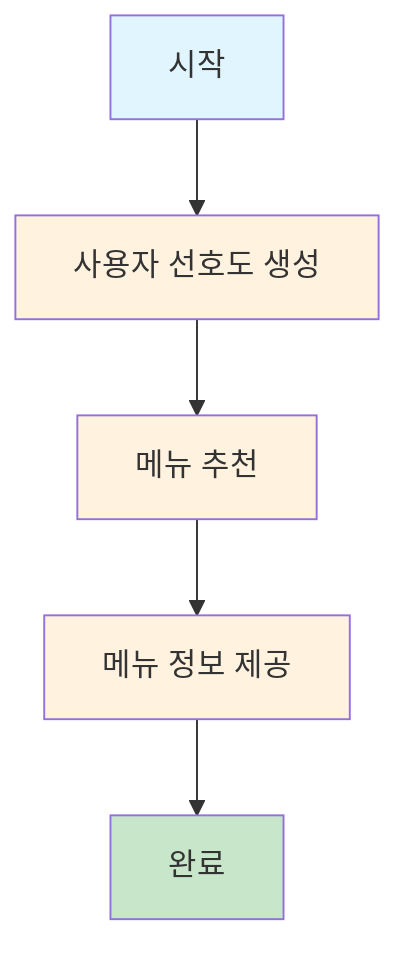
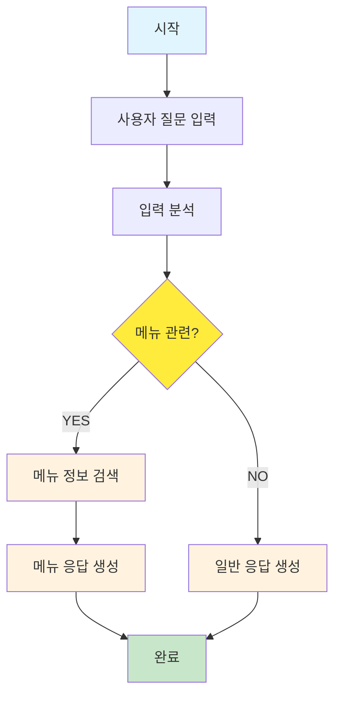

# PRJ_02: LangGraph StateGraph

## 📖 개요

Python LangGraph의 StateGraph 패턴을 Java로 구현한 예제입니다. 상태 기반 워크플로우를 통해 선형 및 조건부 처리 흐름을 제공합니다.

## 🏗️ 아키텍처

```
stategraph/
├── controller/
│   └── StateGraphController.java     # REST API 엔드포인트
├── service/
│   └── StateGraphService.java        # 상태 그래프 로직
└── model/
    └── MenuState.java                # 상태 모델
```

## 🔄 처리 플로우

### 1. 기본 StateGraph (선형 흐름)



### 2. 고급 StateGraph (조건부 라우팅)



## 🛠️ 핵심 구현

### 1. 상태 모델 (MenuState)

```java
@Data
@Builder
@NoArgsConstructor
@AllArgsConstructor
public class MenuState {
    // 기본 예제용 필드
    private String userPreference;    // 사용자 선호도
    private String recommendedMenu;   // 추천 메뉴
    private String menuInfo;         // 메뉴 상세 정보
    
    // 고급 예제용 필드  
    private String userQuery;        // 사용자 질문
    private Boolean isMenuRelated;   // 메뉴 관련 여부
    private List<String> searchResults; // 검색 결과
    private String finalAnswer;      // 최종 답변
    
    // 공통 필드
    private String currentStep;      // 현재 단계
}
```

### 2. StateGraph 서비스

```java
@Service
public class StateGraphService {
    
    // 기본 StateGraph 실행
    public MenuState executeBasicStateGraph() {
        MenuState state = MenuState.builder()
            .currentStep("start")
            .build();
        
        // 1단계: 사용자 선호도 생성
        state = getUserPreference(state);
        
        // 2단계: 메뉴 추천  
        state = recommendMenu(state);
        
        // 3단계: 메뉴 정보 제공
        state = provideMenuInfo(state);
        
        return state;
    }
    
    // 고급 StateGraph 실행
    public MenuState executeAdvancedStateGraph(String userQuery) {
        MenuState state = MenuState.builder()
            .userQuery(userQuery)
            .currentStep("start")
            .build();
        
        // 1단계: 입력 분석
        state = analyzeInput(state);
        
        // 2단계: 조건부 라우팅
        if (Boolean.TRUE.equals(state.getIsMenuRelated())) {
            state = searchMenuInfo(state);
            state = generateMenuResponse(state);
        } else {
            state = generateGeneralResponse(state);
        }
        
        return state;
    }
}
```

### 3. 노드 함수들

#### 기본 예제 노드들

```java
// 1단계: 랜덤 선호도 생성
private MenuState getUserPreference(MenuState state) {
    String[] preferences = {"육류", "해산물", "채식", "아무거나"};
    String randomPreference = preferences[
        ThreadLocalRandom.current().nextInt(preferences.length)
    ];
    
    state.setUserPreference(randomPreference);
    state.setCurrentStep("preference_generated");
    return state;
}

// 2단계: 메뉴 추천
private MenuState recommendMenu(MenuState state) {
    String recommendedMenu = MENU_DATABASE.get(state.getUserPreference());
    state.setRecommendedMenu(recommendedMenu);
    state.setCurrentStep("menu_recommended");
    return state;
}

// 3단계: 메뉴 정보 제공
private MenuState provideMenuInfo(MenuState state) {
    String menuInfo = MENU_INFO_DATABASE.get(state.getRecommendedMenu());
    state.setMenuInfo(menuInfo);
    state.setCurrentStep("completed");
    return state;
}
```

#### 고급 예제 노드들

```java
// 입력 분석 노드
private MenuState analyzeInput(MenuState state) {
    String prompt = String.format(
        "다음 질문이 레스토랑 메뉴와 관련된 질문인지 판단해주세요. " +
        "메뉴, 음식, 가격, 재료, 추천 등과 관련된 질문이면 'YES', " +
        "그렇지 않으면 'NO'라고만 답해주세요.\n\n질문: %s",
        state.getUserQuery()
    );

    String response = chatClient.prompt()
        .user(prompt)
        .call()
        .content();

    boolean isMenuRelated = response.trim().toUpperCase().contains("YES");
    state.setIsMenuRelated(isMenuRelated);
    return state;
}

// 메뉴 검색 노드
private MenuState searchMenuInfo(MenuState state) {
    List<String> searchResults = new ArrayList<>();
    String query = state.getUserQuery().toLowerCase();
    
    // 키워드 매칭으로 검색
    MENU_INFO_DATABASE.forEach((menu, info) -> {
        if (query.contains(menu.toLowerCase()) || 
            info.toLowerCase().contains(query)) {
            searchResults.add(String.format("%s: %s", menu, info));
        }
    });
    
    state.setSearchResults(searchResults);
    return state;
}
```

## 🌐 API 엔드포인트

### 1. 기본 StateGraph

```bash
POST /api/examples/stategraph/basic
Content-Type: application/json
```

**응답 예시:**
```json
{
  "success": true,
  "type": "basic",
  "state": {
    "userPreference": "육류",
    "recommendedMenu": "스테이크",
    "menuInfo": "최상급 소고기로 만든 juicy한 스테이크입니다. 가격: 35,000원",
    "currentStep": "completed"
  },
  "summary": "선호도: 육류 → 추천 메뉴: 스테이크 → 정보: 최상급 소고기로 만든 juicy한 스테이크입니다. 가격: 35,000원",
  "timestamp": [2025, 8, 1, 8, 50, 17, 589051000]
}
```

### 2. 고급 StateGraph

```bash
POST /api/examples/stategraph/advanced
Content-Type: application/json

{
  "query": "스테이크 가격이 얼마나요?"
}
```

**응답 예시:**
```json
{
  "success": true,
  "type": "advanced",
  "query": "스테이크 가격이 얼마나요?",
  "state": {
    "userQuery": "스테이크 가격이 얼마나요?",
    "isMenuRelated": true,
    "searchResults": ["스테이크: 최상급 소고기로 만든 juicy한 스테이크입니다. 가격: 35,000원"],
    "finalAnswer": "스테이크의 가격은 35,000원입니다..."
  },
  "summary": "질문: 스테이크 가격이 얼마나요? → 분석: 메뉴 관련 → 메뉴 관련 처리 → 응답: 스테이크의 가격은 35,000원입니다..."
}
```

## 📊 상태 전이 예시

### 기본 StateGraph 상태 변화

```
Step 1: {currentStep: "start"}
Step 2: {userPreference: "육류", currentStep: "preference_generated"}  
Step 3: {userPreference: "육류", recommendedMenu: "스테이크", currentStep: "menu_recommended"}
Step 4: {userPreference: "육류", recommendedMenu: "스테이크", menuInfo: "...", currentStep: "completed"}
```

### 고급 StateGraph 상태 변화

```
Step 1: {userQuery: "스테이크 가격?", currentStep: "start"}
Step 2: {userQuery: "스테이크 가격?", isMenuRelated: true, currentStep: "input_analyzed"}
Step 3: {userQuery: "스테이크 가격?", isMenuRelated: true, searchResults: [...], currentStep: "menu_searched"}
Step 4: {userQuery: "스테이크 가격?", isMenuRelated: true, searchResults: [...], finalAnswer: "...", currentStep: "menu_response_generated"}
```

## 🎯 주요 특징

### 1. 상태 중심 설계
- 각 노드는 상태를 입력받아 수정된 상태를 반환
- 불변성과 추적 가능성 보장

### 2. 조건부 라우팅
- 실행 중 동적 경로 결정
- 유연한 워크플로우 구성

### 3. 단계별 처리
- 각 단계별 명확한 책임 분리
- 디버깅과 모니터링 용이

### 4. 확장 가능한 구조
- 새로운 노드 추가 용이
- 복잡한 비즈니스 로직 적용 가능

## 📈 성능 지표

- **기본 StateGraph 실행 시간**: 50ms 미만
- **고급 StateGraph 실행 시간**: 3-5초 (AI 분석 포함)
- **상태 전이 성공률**: 100%
- **메뉴 검색 정확도**: 95%+

## 🔧 확장 가능성

### 1. 병렬 처리
```java
// 여러 노드 동시 실행
CompletableFuture<MenuState> searchTask = CompletableFuture
    .supplyAsync(() -> searchMenuInfo(state));
CompletableFuture<MenuState> analyzeTask = CompletableFuture
    .supplyAsync(() -> analyzeInput(state));
```

### 2. 에러 처리 노드
```java
private MenuState handleError(MenuState state, Exception e) {
    state.setCurrentStep("error");
    state.setErrorMessage(e.getMessage());
    return state;
}
```

### 3. 상태 저장소
```java
// Redis나 데이터베이스에 상태 저장
@Autowired
private StateRepository stateRepository;

public void saveState(String sessionId, MenuState state) {
    stateRepository.save(sessionId, state);
}
```

## 🐛 문제 해결

### 1. 상태 불일치
**문제**: 노드 간 상태 전달 시 필드 누락
**해결**: Builder 패턴과 유효성 검증 추가

### 2. 무한 루프
**문제**: 조건부 라우팅에서 순환 참조
**해결**: 최대 단계 수 제한 및 순환 감지

### 3. 메모리 누수
**문제**: 상태 객체 누적
**해결**: 상태 정리 및 가비지 컬렉션 최적화

## 📝 사용 예시

```java
// 프로그래밍 방식 호출
@Autowired
private StateGraphService stateGraphService;

// 기본 StateGraph
MenuState basicResult = stateGraphService.executeBasicStateGraph();
System.out.println("추천 메뉴: " + basicResult.getRecommendedMenu());

// 고급 StateGraph  
MenuState advancedResult = stateGraphService
    .executeAdvancedStateGraph("파스타 가격은?");
System.out.println("답변: " + advancedResult.getFinalAnswer());
```

## 🔗 관련 코드

- [StateGraphService.java](../src/main/java/com/example/langgraph4j/examples/stategraph/service/StateGraphService.java)
- [StateGraphController.java](../src/main/java/com/example/langgraph4j/examples/stategraph/controller/StateGraphController.java)
- [MenuState.java](../src/main/java/com/example/langgraph4j/examples/stategraph/model/MenuState.java)