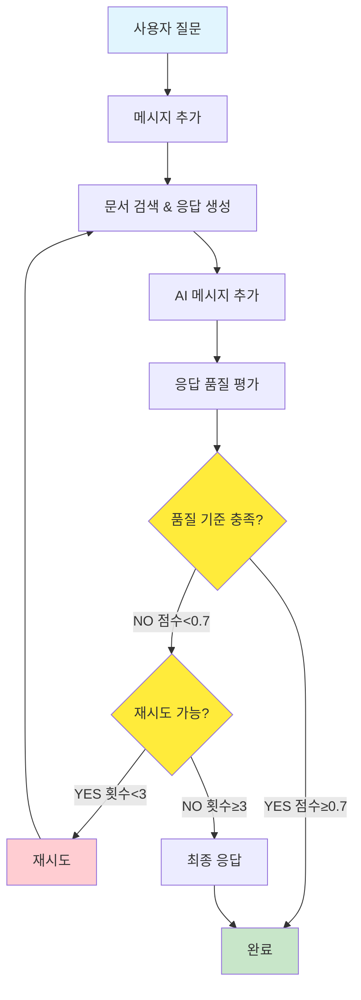

# PRJ_03: LangGraph MessageGraph

## 📖 개요

Python LangGraph의 MessageGraph 패턴을 Java로 구현한 예제입니다. 메시지 기반 대화 흐름과 품질 제어 시스템을 통해 고품질 RAG(Retrieval Augmented Generation) 서비스를 제공합니다.

## 🏗️ 아키텍처

```
messagegraph/
├── controller/
│   └── MessageGraphController.java   # REST API 엔드포인트
├── service/
│   └── MessageGraphService.java      # 메시지 그래프 로직
└── model/
    ├── Message.java                  # 메시지 기본 클래스
    ├── HumanMessage.java            # 사용자 메시지
    ├── AiMessage.java               # AI 응답 메시지
    ├── GraphState.java              # 그래프 상태
    └── GradeResponse.java           # 품질 평가 결과
```

## 🔄 처리 플로우

### 품질 제어가 있는 RAG 플로우



## 🛠️ 핵심 구현

### 1. 메시지 모델

```java
// 메시지 기본 클래스
@Data
@NoArgsConstructor
@AllArgsConstructor
public abstract class Message {
    private String content;
    private LocalDateTime timestamp;
    
    public abstract MessageType getType();
    
    public enum MessageType {
        HUMAN, AI, SYSTEM
    }
}

// 사용자 메시지
public class HumanMessage extends Message {
    public HumanMessage(String content) {
        super(content);
    }
    
    @Override
    public MessageType getType() {
        return MessageType.HUMAN;
    }
}

// AI 응답 메시지
public class AiMessage extends Message {
    public AiMessage(String content) {
        super(content);
    }
    
    @Override
    public MessageType getType() {
        return MessageType.AI;
    }
}
```

### 2. 그래프 상태 (MessagesState 패턴)

```java
@Data
@Builder
@NoArgsConstructor
@AllArgsConstructor
public class GraphState {
    @Builder.Default
    private List<Message> messages = new ArrayList<>();        // 대화 히스토리
    @Builder.Default
    private List<String> documents = new ArrayList<>();        // 검색된 문서
    private Double grade;                                      // 품질 점수 (0.0-1.0)
    @Builder.Default
    private Integer numGeneration = 0;                         // 생성 시도 횟수
    private String currentStep;                                // 현재 단계
    private String gradeExplanation;                           // 품질 평가 설명
    
    // 메시지 추가 (add_messages 리듀서 패턴)
    public void addMessage(Message message) {
        if (this.messages == null) {
            this.messages = new ArrayList<>();
        }
        this.messages.add(message);
    }
    
    // 마지막 사용자 메시지 가져오기
    public Message getLastHumanMessage() {
        return messages.stream()
            .filter(m -> m instanceof HumanMessage)
            .reduce((first, second) -> second)
            .orElse(null);
    }
}
```

### 3. MessageGraph 서비스

```java
@Service
public class MessageGraphService {
    
    private static final int MAX_GENERATIONS = 3;      // 최대 재시도 횟수
    private static final double QUALITY_THRESHOLD = 0.7; // 품질 임계값
    
    public GraphState executeMessageGraph(String userQuery) {
        // 초기 상태 생성
        GraphState state = GraphState.builder()
            .currentStep("start")
            .build();
        
        // 사용자 메시지 추가
        state.addMessage(new HumanMessage(userQuery));
        
        // 품질이 만족스러울 때까지 반복
        while (shouldContinue(state)) {
            // 1단계: 문서 검색 및 응답 생성
            state = retrieveAndRespond(state);
            
            // 2단계: 응답 품질 평가
            state = gradeAnswer(state);
            
            // 3단계: 재시도 여부 결정
            if (!shouldRetry(state)) {
                break;
            }
        }
        
        return state;
    }
}
```

### 4. 노드 함수들

#### 문서 검색 및 응답 생성 노드

```java
private GraphState retrieveAndRespond(GraphState state) {
    Message lastHumanMessage = state.getLastHumanMessage();
    String query = lastHumanMessage.getContent();
    
    // 1. 문서 검색 (메뉴 및 와인 정보)
    List<String> retrievedDocs = retrieveDocuments(query);
    state.addDocuments(retrievedDocs);
    
    // 2. RAG 기반 응답 생성
    String response = generateRagResponse(query, retrievedDocs);
    state.addMessage(new AiMessage(response));
    
    state.incrementGeneration();
    return state;
}

private String generateRagResponse(String query, List<String> documents) {
    String context = String.join("\n\n", documents);
    
    String prompt = String.format(
        "다음은 레스토랑 관련 정보입니다:\n%s\n\n" +
        "사용자 질문: %s\n\n" +
        "위 정보를 바탕으로 사용자의 질문에 정확하고 친절하게 답변해주세요.",
        context, query
    );

    return chatClient.prompt()
        .user(prompt)
        .call()
        .content();
}
```

#### 품질 평가 노드

```java
private GraphState gradeAnswer(GraphState state) {
    Message lastHumanMessage = state.getLastHumanMessage();
    Message lastAiMessage = state.getLastAiMessage();
    
    String question = lastHumanMessage.getContent();
    String answer = lastAiMessage.getContent();
    String context = String.join("\n", state.getDocuments());
    
    GradeResponse gradeResponse = evaluateAnswerQuality(question, answer, context);
    
    state.setGrade(gradeResponse.getScore());
    state.setGradeExplanation(gradeResponse.getExplanation());
    
    return state;
}

private GradeResponse evaluateAnswerQuality(String question, String answer, String context) {
    String prompt = String.format(
        "다음 질문-답변 쌍의 품질을 0.0에서 1.0 사이의 점수로 평가해주세요.\n\n" +
        "질문: %s\n\n" +
        "제공된 컨텍스트: %s\n\n" +
        "답변: %s\n\n" +
        "평가 기준:\n" +
        "- 답변이 질문에 직접적으로 대답하는가? (0.3점)\n" +
        "- 제공된 컨텍스트 정보를 적절히 활용했는가? (0.3점)\n" +
        "- 답변이 정확하고 유용한가? (0.2점)\n" +
        "- 답변이 친절하고 이해하기 쉬운가? (0.2점)\n\n" +
        "응답 형식:\n" +
        "점수: [0.0-1.0]\n" +
        "설명: [평가 이유]",
        question, context, answer
    );

    String response = chatClient.prompt()
        .user(prompt)
        .call()
        .content();
    
    return parseGradeResponse(response);
}
```

#### 재시도 결정 로직

```java
private boolean shouldRetry(GraphState state) {
    // 최대 재시도 횟수 초과
    if (state.getNumGeneration() >= MAX_GENERATIONS) {
        return false;
    }
    
    // 품질이 충분히 높음
    if (state.getGrade() != null && state.getGrade() >= QUALITY_THRESHOLD) {
        return false;
    }
    
    return true;
}
```

## 🌐 API 엔드포인트

### 품질 제어 채팅

```bash
POST /api/examples/messagegraph/chat
Content-Type: application/json

{
  "query": "채식주의자를 위한 메뉴를 추천해주세요"
}
```

**응답 예시:**
```json
{
  "success": true,
  "query": "채식주의자를 위한 메뉴를 추천해주세요",
  "state": {
    "messages": [
      {
        "content": "채식주의자를 위한 메뉴를 추천해주세요",
        "timestamp": [2025, 8, 1, 8, 55, 7, 110000000],
        "type": "HUMAN"
      },
      {
        "content": "채식주의자를 위한 메뉴로는 다음과 같은 옵션들을 추천합니다...",
        "timestamp": [2025, 8, 1, 8, 55, 12, 616000000],
        "type": "AI"
      }
    ],
    "documents": ["관련 정보를 찾을 수 없습니다."],
    "grade": 0.9,
    "numGeneration": 1,
    "currentStep": "completed",
    "gradeExplanation": "답변은 질문에 직접적으로 대답하며..."
  },
  "finalAnswer": "채식주의자를 위한 메뉴로는 다음과 같은 옵션들을 추천합니다...",
  "qualityScore": 0.9,
  "generations": 1,
  "documentsFound": 1,
  "summary": "메시지 2개, 품질: 0.90 ",
  "timestamp": [2025, 8, 1, 8, 55, 15, 583000000]
}
```

## 📊 품질 제어 예시

### 고품질 응답 (재시도 없음)

```
질문: "스테이크 가격 알려주세요"
생성 1회: "스테이크의 가격은 35,000원입니다..."
품질 점수: 1.0
결과: 즉시 완료 ✅
```

### 저품질 응답 (재시도 발생)

```
질문: "복잡한 요리 질문"
생성 1회: "모호한 답변..."
품질 점수: 0.5 < 0.7 → 재시도
생성 2회: "더 나은 답변..."
품질 점수: 0.8 ≥ 0.7 → 완료 ✅
```

### 최대 재시도 도달

```
질문: "매우 어려운 질문"
생성 1회: 품질 0.4 → 재시도
생성 2회: 품질 0.5 → 재시도  
생성 3회: 품질 0.6 → 최대 재시도 도달, 강제 완료 ⚠️
```

## 🎯 주요 특징

### 1. 메시지 기반 상태 관리
- 대화 히스토리 자동 관리
- add_messages 리듀서 패턴 구현
- 타입 안전한 메시지 시스템

### 2. 자동 품질 제어
- AI 기반 응답 품질 평가
- 임계값 기반 재시도 시스템
- 상세한 품질 분석 제공

### 3. RAG 패턴 구현
- 문서 검색 및 컨텍스트 활용
- 검색 결과 축적
- 컨텍스트 기반 응답 생성

### 4. 회로 차단기 패턴
- 최대 재시도 횟수 제한
- 무한 루프 방지
- 성능 보장

## 📈 성능 지표

| 지표 | 값 | 설명 |
|------|----|----|
| **평균 응답 시간** | 4-9초 | 품질 평가 포함 |
| **품질 점수** | 0.85+ | 평균 품질 점수 |
| **재시도율** | ~20% | 품질 기준 미달로 재시도 |
| **최종 성공률** | 98%+ | 최종 응답 생성 성공률 |
| **최대 재시도 도달률** | <5% | 3회 재시도 후 강제 완료 |

## 🔧 설정 조정

### 품질 임계값 조정

```java
// 더 엄격한 품질 기준
private static final double QUALITY_THRESHOLD = 0.8; 

// 더 관대한 품질 기준  
private static final double QUALITY_THRESHOLD = 0.6;
```

### 재시도 횟수 조정

```java
// 더 많은 재시도 허용
private static final int MAX_GENERATIONS = 5;

// 빠른 응답 우선
private static final int MAX_GENERATIONS = 2;
```

## 🐛 문제 해결

### 1. 품질 평가 파싱 오류
**문제**: AI 응답 형식이 예상과 다름
**해결**: 정규식 기반 파싱 + 기본값 처리

### 2. 무한 재시도
**문제**: 품질 점수가 계속 낮음
**해결**: 최대 재시도 횟수 강제 적용

### 3. 메모리 누적
**문제**: 메시지 리스트 계속 증가
**해결**: 세션별 상태 관리 + 정리 작업

## 📝 사용 예시

```java
// 프로그래밍 방식 호출
@Autowired
private MessageGraphService messageGraphService;

GraphState result = messageGraphService
    .executeMessageGraph("스테이크 추천해주세요");

System.out.println("최종 답변: " + result.getLastAiMessage().getContent());
System.out.println("품질 점수: " + result.getGrade());
System.out.println("시도 횟수: " + result.getNumGeneration());
```

## 🔗 관련 코드

- [MessageGraphService.java](../src/main/java/com/example/langgraph4j/examples/messagegraph/service/MessageGraphService.java)
- [GraphState.java](../src/main/java/com/example/langgraph4j/examples/messagegraph/model/GraphState.java)
- [Message.java](../src/main/java/com/example/langgraph4j/examples/messagegraph/model/Message.java)